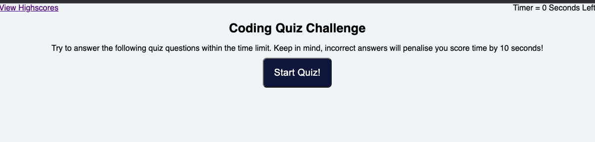

# 04 Web APIs: Jenny's Code Quiz

## Description
My Challenge invites me to build a timed coding quiz with multiple-choice questions. This app will run in the browser and will feature dynamically updated HTML and CSS powered by JavaScript code written by me. It will have a clean, polished, and responsive user interface. 
I want to build a timed quiz on JavaScript fundamentals that stores high scores.

## Usage

To play the quiz, click the Start Quiz Button!

You can get there by clicking this link to the deployed site: https://jnaoroji.github.io/WebAPIs-Code-QuizJN/

## Screenshot

The following image shows my web application's appearance and functionality:

## Credits

* https://developer.mozilla.org
* This gif was used as the predominant guideline for this quiz.
* 
* used as template for interval timer: file:///Users/jennynaoroji/bootcamp/bootcamp-repo/UADEL-VIRT-FSF-PT-03-2023-U-LOLC/04-Web-APIs/01-Activities/09-Ins_Timers-Intervals/index.html
* Used as template for index.html and index2.html:file:///Users/jennynaoroji/bootcamp/bootcamp-repo/UADEL-VIRT-FSF-PT-03-2023-U-LOLC/04-Web-APIs/01-Activities/22-Stu_Local-Storage/Solved/index.html

## License

Please refer to the LICENSE in the repo.

